# User Guide

## View Manager Panel

**Panel Open**
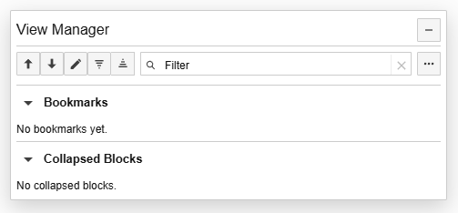
Shows Title Bar, Bookmarks and Collapsed Blocks sections, and the Actions dropdown menu.

---

**Title Bar**
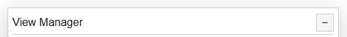
- Draggable title bar to move the panel around the page.
- Minimise button to collapse the panel to a small title bar.

---

**Tool Bar**
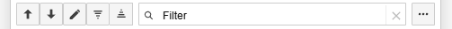
- Goto Top button to scroll the page to the top.
- Goto Bottom button to scroll the page to the bottom.
- Custom Prompt button to open the Custom Prompt Dialog.
- Collapse All button to collapse all conversation blocks on the page.
- Expand All button to expand all collapsed conversation blocks on the page.
- Filter/Search input to filter bookmarks and collapsed blocks by text.
- Actions dropdown button to open the Actions menu for theme, import/export, and other options.

---

**Bookmarks Section**
***Empty*** 
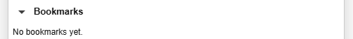
***With Entries***
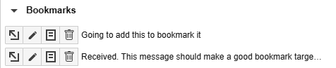

---

**Collapsed Blocks Section**
***Empty***
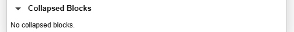
***With Entries***
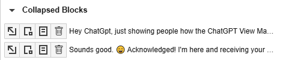

---

**Panel Collapsed/Minimised**

- Restore button to open the panel again.

---

## Hover Toolbar

**Normal Conversation block**
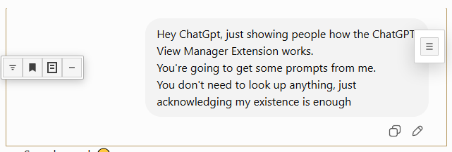
- Participant icon shows the participant of the conversation block, user or ChatGPT.
- Collapse button to collapse the conversation block.
- Bookmark button to bookmark the conversation block.
- Notes button to add/edit notes for the conversation block.
- Minimise button to minimise the conversation block.

---

**Hover Toolbar Minimised**
***Minimise the Hover Toolbar to a small icon on the conversation block to reduce clutter.***

- Restore button to restore the Hover Toolbar to full size.

---

**Collapsed Block Information Bar**
Shows a collapsed block with participant/collapsed/note indicators if possible.
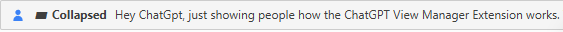

- Participant icon shows the participant of the collapsed block, user (blue person) or ChatGPT (Green robot).
- Collapsed indicator shows the block is collapsed.
- Red note indicator shows the block has notes attached.
- Summary text shows the first few words of the collapsed block.

---

## Notes dialog
Show add/edit note dialog with Delete, Cancel, Save Notes buttons.
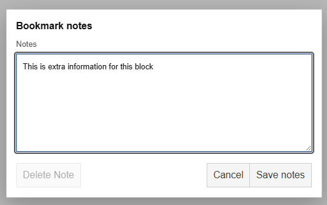
- Text note area to add/edit notes for the conversation block.
- Delete button to delete the note for the conversation block.
- Cancel button to close the dialog without saving changes.
- Save Notes button to save the note for the conversation block.

---

## Custom Prompt Dialog
Show floating prompt editor above/near ChatGPT composer.
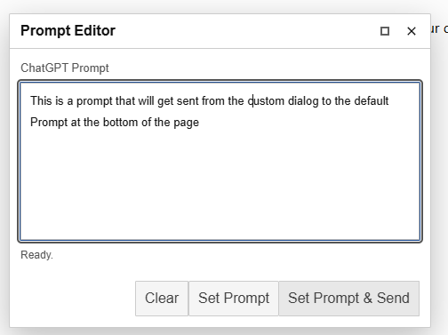
- Header
  - Maximise button to expand the dialog to full width and height of the page.
  - Close button to close the dialog without sending text to ChatGPT prompt composer.
- Body
  - Text area to enter text to send to ChatGPT prompt composer.
- Footer
  - Set Prompt button to send the text to ChatGPT prompt composer without processing it.
  - Set Prompt and Send button to send the text to ChatGPT prompt composer and submit it for processing.

---

**Default Prompt with Text Sent from Custom Prompt Dialog**
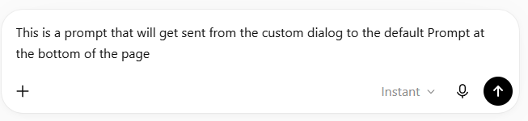

---

## Actions dropdown
Show theme/import/export menu open.
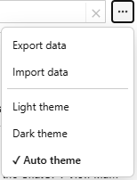
- Theme menu to select light or dark theme for the extension.
- Import/Export menu to import/export View Manager data as a JSON file.

## Filter In Use

**Unfiltered Bookmarks and Blocks**
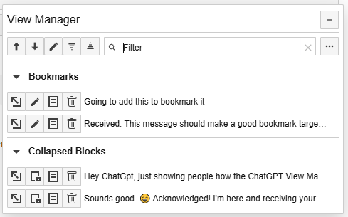
**Filtered Bookmarks and Blocks**
***Filtered on "goi"***
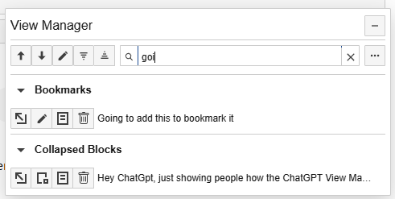

---

## Themes

**Light theme**
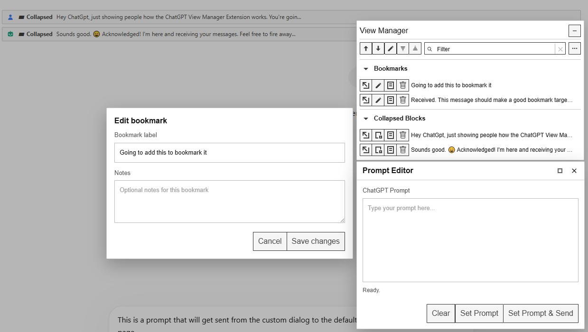

---

**Dark theme**
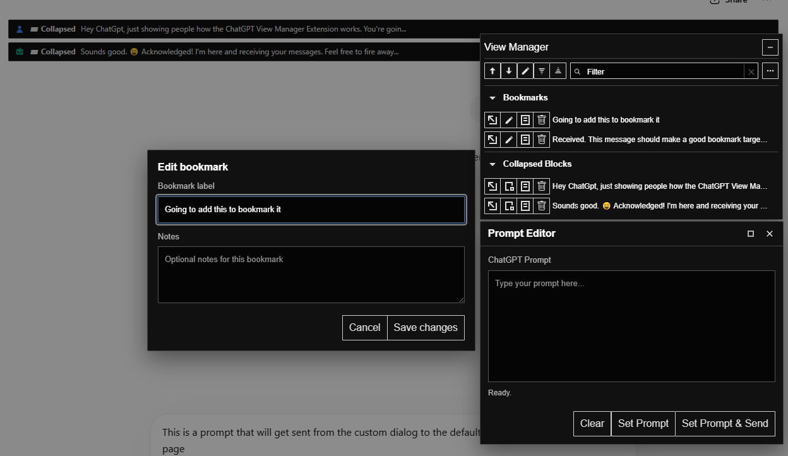

---

## Import/Export Flow
**Export**
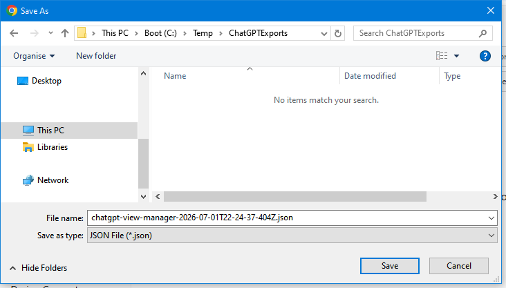
- Select Folder and enter a file name to export View Manager data as a JSON file.

---

**Import**
- Select a JSON file to import View Manager data.
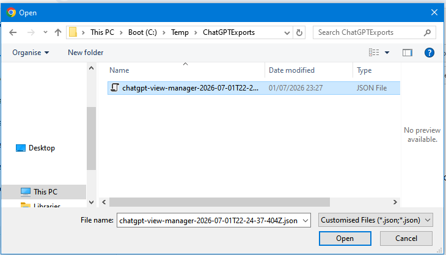
- Confirm import of View Manager data from the selected JSON file.
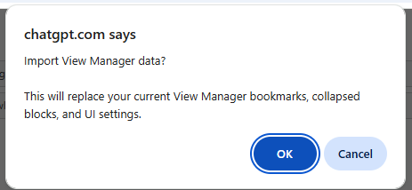
- Successful import alert and ChatGPT View Manager updated with imported data.
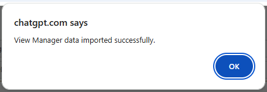

---

## Custom Prompt Dialog maximised
**Custom Prompt Dialog maximised**
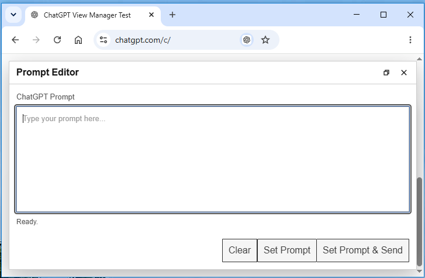

---

